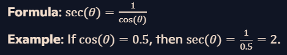
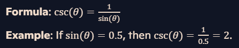
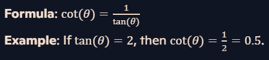

## Trigonometric Functions Explained:

#### Secant (sec):
###### Definition: Secant is the reciprocal of the cosine function.

#### Cosecant (csc):
###### Definition: Cosecant is the reciprocal of the sine function.

#### Cotangent (cot):
###### Definition: Cotangent is the reciprocal of the tangent function.

